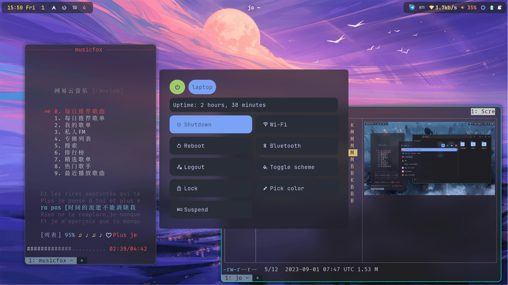
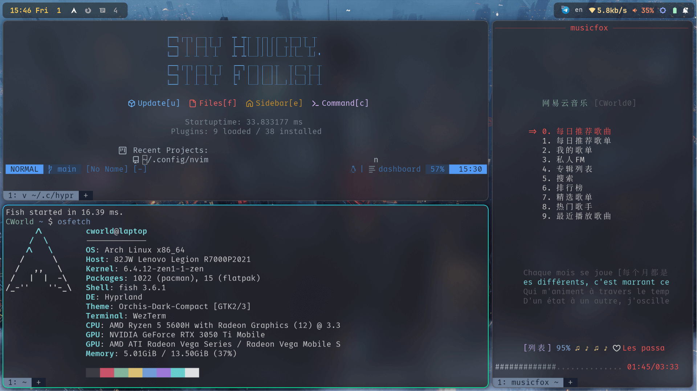
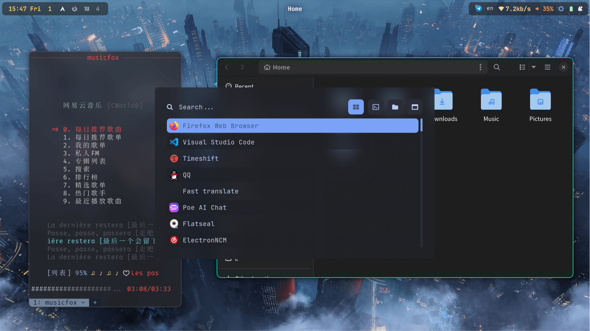
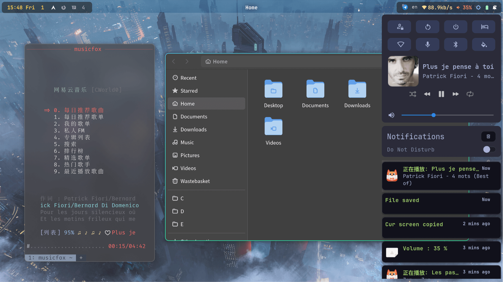

# Dotfiles

Dotfiles of CWorld.

## Screenshots

# Installation

Config files contains configs of the following packages:

- fcitx5 & fcitx5-chinese-addons (Also support rime)
- fish
- git
- hyprland
- hyprpaper
- joshuto
- neofetch
- rofi
- surfingkeys (firefox plugin)
- swaylock-effects
- swaync
- wezterm
- vscode (only flag)
- electron (only flag)

If you don't want to use any of them, delete it or move to another path before running `install.sh`.

> `install.sh` will help you create soft link to `$XDG_CONFIG_HOME` or `$HOME/.config`. If there exists conflicts, it will create backups automatically.
